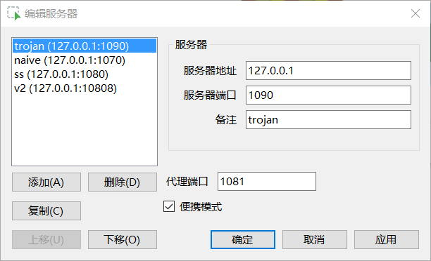

# proxyswitchy-windows
I'm using shadowsocks,v2ray,trojan... on my Windows system, both of them support a local SOCKS5 proxy. 

I always use cli instead of gui because of security, but i need a gui tool to switch system proxy environment and provide a port-persistence http proxy unrelated socks provider.

This tool is used to meet my above needs:

# icon
Icon made by [Pixel perfect](https://www.flaticon.com/authors/pixel-perfect) from [www.flaticon.com](http://www.flaticon.com/).